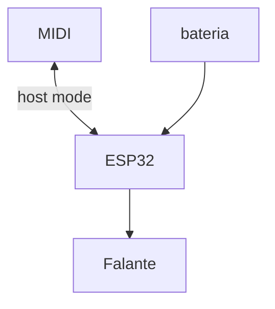

# Objetivo e componentes

Um sintetizador + falantes + bateria que se pluga em qualquer teclado MIDI

Não vou mentir. Queria poder tocar meu controladorzinho MIDI no carro e tentar acompanhar as notas das músicas que estão tocando no rádio

Quem sabe um dia poder ter um banco de dados com controladores MIDI conhecidos para os knobs serem automaticamente relacionados

Quem sabe um dia ter um esquema para poder fazer remake de musicas conhecidas, já colocando quais synths, baterias, vozes e até lyrics (lol)

## Microcontrolador ESP32 + AudioKit

Parece a escolha ideal pois:
- Possui bluetooth para poder controlar parametros pelo celular
- Possui entrada USB e capacidade HOST para o MIDI
- Possui processador capaz para poder plugar uma tela e controlar com knobs do MIDI mesmo
- Audio kit já tem DAC para tocar falantes de 5w e saída de fone
- Audio kit já tem controlador de bateria 

# Passos

1. Verificar como fazer a conexão MIDI
	1. Configurar modo HOST no ESP32
	2. Verificar se ele consegue fornecer energia suficiente
	3. Receber comandos MIDI
2. Como fazer som no ESP32?
	1. Usar qual biblioteca?
	2. Talvez usar controle analógico de voltagem para não ter delay??
	3. 

# Esquema

