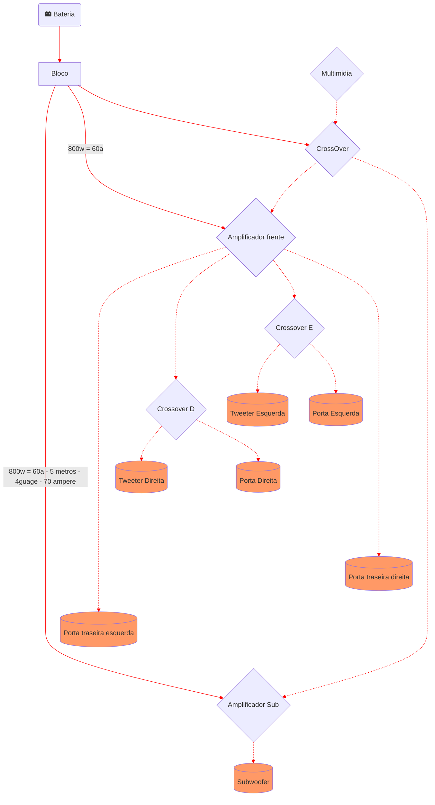

# Objetivo e componentes

Qualidade e facilidade de remoção (e budget)
- Subwoofer de 12" porque eu tinha um de 8" e não trazia _aquele_ sentimento (R$800)
- Componente de qualidade  (R$600)
- 6x9 nas portas trazeiras (R$300)
- 1 amp 800w 4ch pra frente (R$400) 
- 1 amp pro sub (R$400)
- Caixa de sub (R$300)
- 1 equalizador (dsp) pra testar se vale a pena (R$300)
- Fiação, fuseis, blocos e mão de obra (R$500)

Estourei, achei que com R$2000 dava

# Esquema

